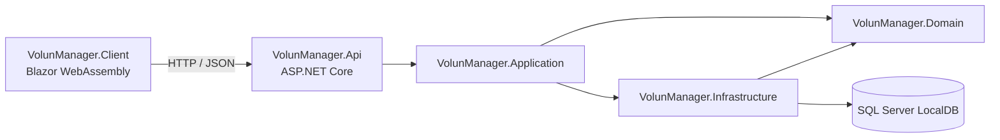

# VolunManager — Gestor de Actividades de Voluntariado

> Sistema distribuido para la gestión de voluntarios, jornadas, asignación de tareas, control de asistencias y generación de reportes en tiempo real.

Este proyecto es la entrega final de **Programación 2** y demuestra el dominio práctico de **Programación Orientada a Objetos (POO)**, separación de responsabilidades (*Clean Architecture*) y comunicación cliente-servidor mediante API REST.

---

## Tabla de contenidos

- [Arquitectura del sistema](#arquitectura-del-sistema)
- [Separación de capas](#separación-de-capas)
- [Aplicación de POO](#aplicación-de-poo-criterios-de-evaluación)
- [Requisitos e instalación](#requisitos-e-instalación)
- [Base de datos e integridad](#base-de-datos-e-integridad)
- [Estructura del proyecto](#estructura-del-proyecto)
- [Autor](#autor)

---

## Arquitectura del sistema

El proyecto implementa una arquitectura distribuida estricta. El cliente y la API se comunican **exclusivamente** mediante peticiones HTTP/JSON, sin compartir referencias de proyectos internos.



## Separación de capas

| Capa | Responsabilidad |
|---|---|
| **Client** *(Blazor WebAssembly)* | Interfaz de usuario independiente, con sus propios DTOs y llamadas HTTP. |
| **Api** | Controladores, Swagger, configuración CORS y manejo global de excepciones. |
| **Application** | Lógica de negocio, servicios (`ServiceResult`) e interfaces de contratos. |
| **Domain** | Entidades principales del dominio y abstracciones de repositorios. |
| **Infrastructure** | Implementación de EF Core, repositorios concretos, migraciones y conexión a la base de datos. |

## Aplicación de POO (Criterios de Evaluación)

El núcleo del dominio (`VolunManager.Domain`) fue diseñado aplicando rigurosamente los pilares de la POO:

- **Clase abstracta y abstracción** — `BaseEntity` centraliza las propiedades comunes (`Id`) y define el contrato base.
- **Métodos abstractos y polimorfismo** — `BaseEntity` declara el método abstracto `ObtenerResumen()`, implementado de manera polimórfica por cada entidad concreta (`Voluntario`, `Jornada`, `Tarea`, etc.) para devolver representaciones únicas (p. ej. nombre completo vs. título de la jornada).
- **Encapsulamiento** — Las propiedades de las entidades utilizan `private set`. Las mutaciones de estado se realizan exclusivamente a través de métodos de dominio controlados.
- **Constructores** — Se usan constructores públicos parametrizados para la creación segura de objetos en la lógica de negocio, y constructores protegidos vacíos requeridos por Entity Framework Core.
- **Sobrecarga (overloading)** — Implementada en `ReporteService`, que ofrece múltiples firmas para `GenerarReporteAsync` (cálculo de horas global vs. cálculo filtrado por rango de fechas).
- **Herencia** — Todas las entidades del modelo heredan de la clase base `BaseEntity`.

## Requisitos e instalación

El proyecto está autocontenido en una única solución (`VolunManager.slnx`) y utiliza **SQL Server LocalDB**, por lo que no requiere configuración de servidores externos.

### Requisitos previos

- [.NET SDK](https://dotnet.microsoft.com/download) (compatible con ASP.NET Core y Blazor WebAssembly)
- SQL Server LocalDB

### Pasos para ejecutar

**1. Clonar el repositorio**

```bash
git clone https://github.com/JustinDominici/Proyecto-Gestor-de-Actividades-de-Voluntariado-VolunManager-.git
cd Proyecto-Gestor-de-Actividades-de-Voluntariado-VolunManager-
```

**2. Aplicar la base de datos**

```bash
dotnet ef database update --project src/VolunManager.Infrastructure --startup-project src/VolunManager.Api
```

**3. Ejecutar la API**

```bash
dotnet run --project src/VolunManager.Api
```

La API estará disponible en `http://localhost:5263` (Swagger: `http://localhost:5263/swagger`).

**4. Ejecutar el cliente Blazor** *(en una nueva terminal)*

```bash
dotnet run --project src/VolunManager.Client
```

El cliente estará disponible en `http://localhost:5173`.

## Base de datos e integridad

El esquema está protegido mediante Fluent API:

- **Índices únicos** para evitar duplicidad (`Voluntario.Correo`, `Rol.Nombre`).
- **Restricciones de longitud máxima** (`MaxLength`) en lugar de tipos ineficientes como `nvarchar(max)`.
- **Reglas estrictas de integridad referencial** (`Cascade` vs. `Restrict`) para prevenir rutas cíclicas de borrado en SQL Server y proteger información histórica.

## Estructura del proyecto

```
VolunManager/
├── src/
│   ├── VolunManager.Client/          # Blazor WebAssembly
│   ├── VolunManager.Api/             # ASP.NET Core (controladores, Swagger, CORS)
│   ├── VolunManager.Application/     # Servicios y contratos (lógica de negocio)
│   ├── VolunManager.Domain/          # Entidades y abstracciones de repositorios
│   └── VolunManager.Infrastructure/  # EF Core, repositorios, migraciones
└── VolunManager.slnx
```

## Autor

Desarrollado por [**Justin Dominici**](https://github.com/JustinDominici) como entrega final de la cátedra de Programación 2.