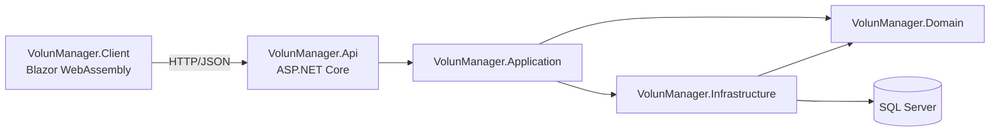

# Arquitectura de VolunManager

## Arquitectura distribuida



## Flujo

```text
Usuario -> Blazor Client -> HTTP/JSON -> API -> Service -> Repository -> EF Core -> SQL Server
```

## Responsabilidades

- Client: interfaz independiente.
- Api: Controllers, Swagger, CORS y manejo global de errores.
- Application: servicios, validaciones y DTOs.
- Domain: entidades y abstracciones.
- Infrastructure: repositorios, EF Core y migraciones.

El objetivo de esta separación es permitir que distintos clientes consuman la misma API sin acoplarse al acceso a datos.
