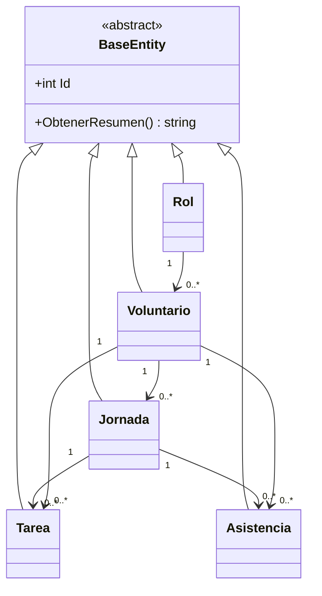
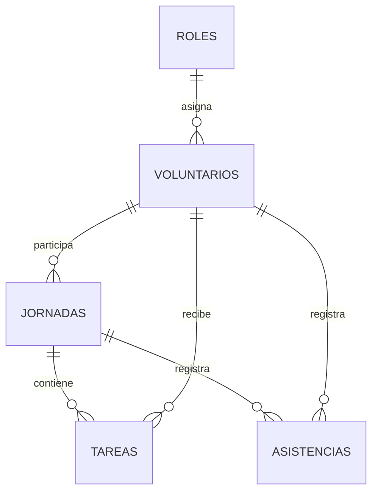

# Diagramas del sistema

## Clases

## Base de datos

## POO

- Abstracción: `BaseEntity`.
- Herencia: las entidades concretas derivan de `BaseEntity`.
- Polimorfismo: cada entidad implementa `ObtenerResumen()`.
- Encapsulamiento: setters privados y métodos de dominio.
- Constructores: parametrizados y protegidos para EF Core.
- Sobrecarga: `ReporteService` tiene métodos con y sin rango de fechas.
